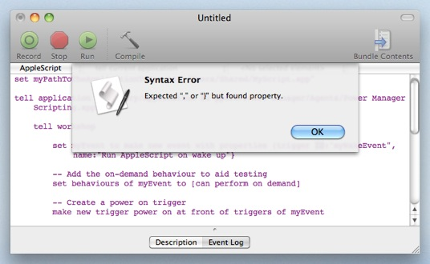

  

When learning new programming languages from different professors, you start to get a feel for how they want you to format your code. For example, when making a function, Professor Ravi wants his students to have the curly brace on a new line by itself, whereas some professors really don't care about your format as long as you complete the task. This was actually true for me because when I was working on Java I never really cared how I formatted my code until I reached ICS 211 that is. Working on the homeworks for that class wasn't too hard of a task, the main difficulty was trying to figure out what was wrong with my code. Yes, I understand that Java tells or hints at you what the problem is but trying to trace your code was something that I could not do with my formatting at that time. The indentations for my code was off I, there were no spacing in my function calls or with my functions in general. You could say that my code was fairly confusing to look through and I started to notice that it was a big problem because I would get confused after looking through it or tracing it. 

Over the past week, I've been working with a new editing software called IntelliJ and Eslint, both are really good to use and I enjoy it. But I don't really enjoy some aspects of the formatting, like having to put a space between the closed parenthesis and the open curly brace or having to make a new line after a closed curly brace. It's these little nitpick with the editing software that I don't generally like, it's possible that I don't enjoy it because as of now it's a hassle for me to get used to this coding style or maybe I just miss using my old editing software (which is atom). No matter what the reason is, I still should learn how to use different editing softwares so that I can expand my knowledge and be prepared when put into that situation.

The main part of using IntelliJ is not to have those pesky red error signs and try to have that green checkmark. When I started using IntelliJ I had a sense of iritation only because my code wouldn't work due to not having a space between the parameter and curly brace or not pressing enter after a smicolon to create a new line. It was these small 
