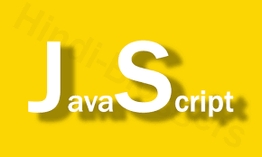

  

When learning new programming languages from different professors, you start to get a feel of how they want you to format your code. For example, when making a function, Professor Ravi wants his students to have the curly brace on a new line by itself, whereas some professors really don't care about your format as long as you complete the task. This was actually true for me because when I was wroking on Java I never really cared how I formatted my code. 

Over the past week I've been working with a new editing software called Intellij and Eslint, both are really good to use and I enjoy it. But I don't really enjoy some aspects of the formatting, like having to put a space between the closed parenthesis and the open curly brace, or having to make a new lin after the closed curly brace. It's these little nit pick with the editing software that I don't generally like, it's possible that I don't enjoy it because as of now it's a hassel for me to get used to this coding style or I just really miss my old editing software (which is atom).
