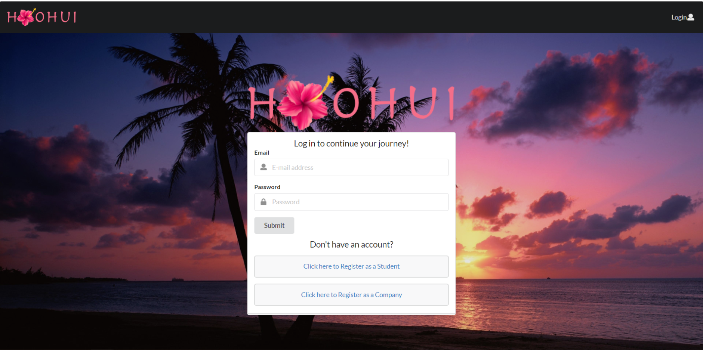
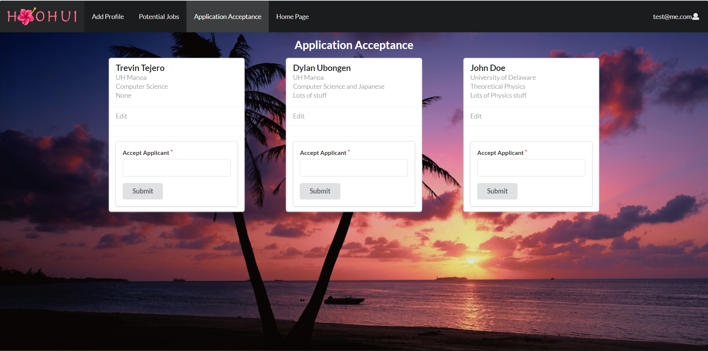
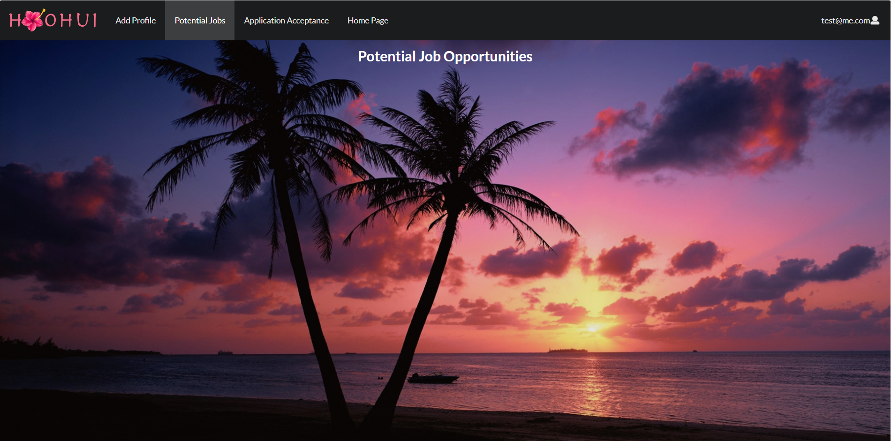

  

## About
Our goal is to create a better way to connect students to job opportunities. This can be from internships to potential job openings, we are striving to inform graduating students about various companies that are hiring within the year in order to give these students a chance at starting their career after college. We also want to include the hiring companies to interact with the students by hvaing them make their own account and choose from the listed users.

  

    

      
    

  

  
  

    

      
    

  

## Experience
This project provided me with a chance to practice and reveal what I learned over the course of ICS 314. For our first milestone, our main goal was to create mockup pages of our thoughts on how we would execute the task, this also brought up future obstacles that we would later need to implement. As for our second milestone, we wanted to implement the basic functionality of our web app, these included the separation of company and student functionality. Basically this means that our biggest problem with the first milestone was that we needed to separate the different pages that each user lands on, luckily we were able to implement this functionality before we moved on to the last milestone. The last milestone was a way for us to polish the functionality of our app and add more to it. For example, we implemented a way of communication between the main users. The implementations that I was assigned were the functionality of the adding a user's applications to every company listing and the application acceptance. Although, I was not able to fully implement the communication side to our project, we were able to get the basic functionality that we planned on completing. 

This project helped me practice what I learned throughout the duration of this class. Whether that is the web app's functionality or the layout/design of the overall app. After this project, I feel that our app has the potential of actually working to connect the community in a positive way.

View the Deployed App: [Click Here](https://hoohui.meteorapp.com/#/) 
View Ho'ohui GitHub Page: [Click Here](https://github.com/ho-ohui/hoohui)
