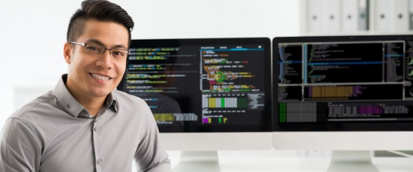

  

In Professor Ravi's class he taught us the use of C and C++ and he gave us homeworks and projects so we can become proficient in the language and a better commputer programmer.

This project had its various difficulties with getting your code to work. I believe with the first project which was designing an address book so that you are able to add someone's address and delete it. The hardest part for me with that specific project was releasing the allocated memory from the heap and the importance of releasing the heap is so that you won't have a memory leak, which could lead your computer to run slow. Now coding in C was pretty hard to do, but thankfully with converting this project into C++ it was a little more bearable and I had less problems I had to deal with compared to my first one. 

This project helped me gain experience with C and C++, also the fact that we had to convert our project from one language to another posed another obstacle that I was able to overcome. In my opinion I do believe that C is a powerful language, but the difficulty and the tedious work you have to put in can be overwhelming.
 
Source Code: [Click Here](https://github.com/dubongen/ics212Project)
